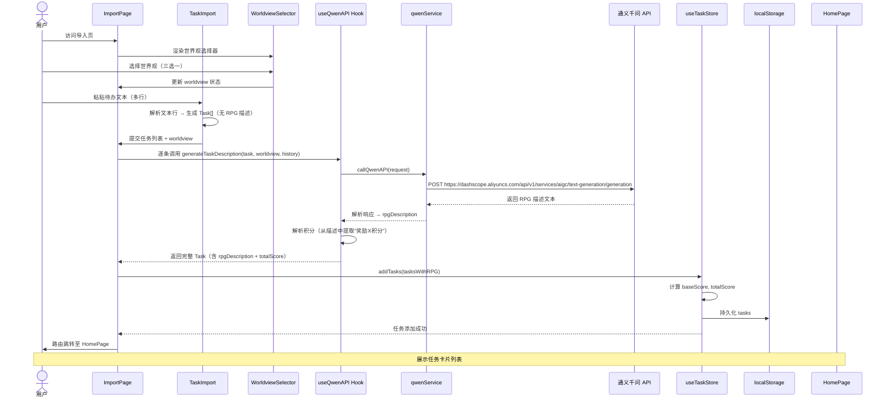
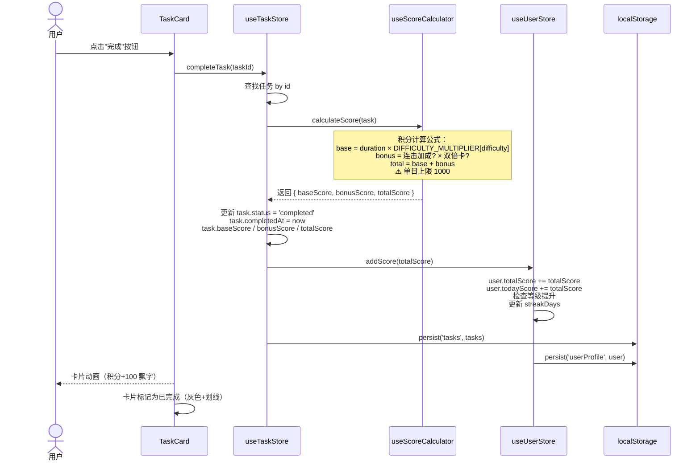
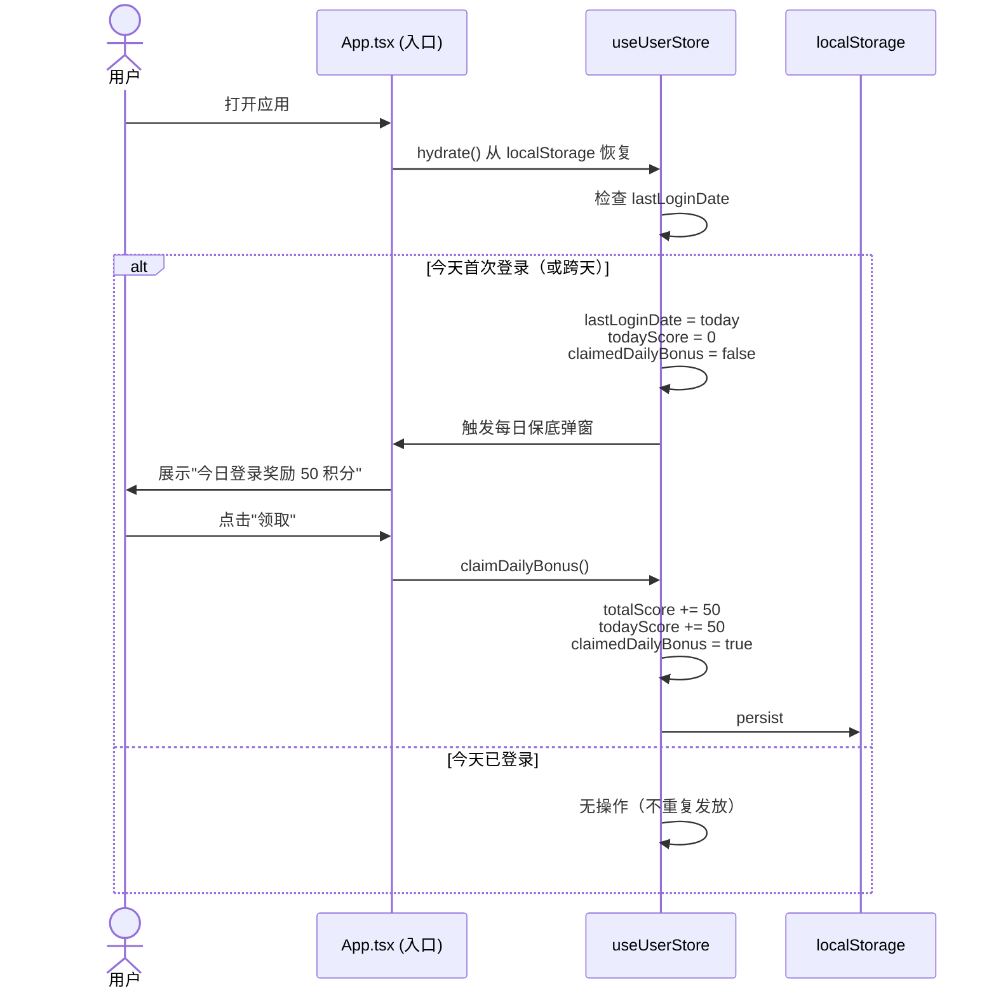

# RPG 待办应用 - 系统架构设计文档

> 版本：v1.0  
> 日期：2026-05-09  
> 架构师：高见远（Gao）  
> 对应 PRD：产品经理许清楚 - RPG待办激励系统 MVP

---

## 目录

1. [实现方案与框架选型](#1-实现方案与框架选型)
2. [文件结构](#2-文件结构)
3. [数据结构与接口](#3-数据结构与接口)
4. [程序调用流程](#4-程序调用流程)
5. [有序任务列表](#5-有序任务列表)
6. [依赖包列表](#6-依赖包列表)
7. [共享约定](#7-共享约定)
8. [潜在技术风险与应对](#8-潜在技术风险与应对)

---

## 1. 实现方案与框架选型

### 1.1 整体架构策略

采用 **纯前端 CSR（Client-Side Rendering）SPA** 架构，无后端服务器，所有数据存储于浏览器 `localStorage`。

```
┌─────────────────────────────────────────────────┐
│                  Browser (SPA)                  │
│  ┌───────────────────────────────────────────┐  │
│  │        Vite + React + TypeScript          │  │
│  │  ┌─────────┐  ┌─────────┐  ┌──────────┐ │  │
│  │  │  Pages  │  │Components│  │  Hooks   │ │  │
│  │  └────┬────┘  └────┬────┘  └────┬─────┘ │  │
│  │       └─────────────┼─────────────┘       │  │
│  │                 ┌────▼────┐                │  │
│  │                 │ Store   │                │  │
│  │                 │(Zustand)│                │  │
│  │                 └────┬────┘                │  │
│  └──────────────────────┼─────────────────────┘  │
│                         │                          │
│  ┌──────────────────────▼─────────────────────┐  │
│  │        localStorage (持久化层)              │  │
│  └───────────────────────────────────────────┘  │
│                         │                          │
│  ┌──────────────────────▼─────────────────────┐  │
│  │     通义千问 qwen-max API (外部服务)        │  │
│  └───────────────────────────────────────────┘  │
└─────────────────────────────────────────────────┘
```

### 1.2 技术栈选型与理由

| 技术 | 版本 | 选型理由 |
|------|------|----------|
| **Vite** | ^6.x | 极速 HMR，构建速度快，原生 ESM 支持 |
| **React** | ^19.x | 组件化开发，生态成熟，MUI 完美适配 |
| **TypeScript** | ^5.x | 类型安全，重构友好，减少运行时错误 |
| **Tailwind CSS** | ^4.x | 原子化 CSS，快速构建主题切换，实用优先 |
| **MUI (Material UI)** | ^7.x | 丰富组件库（卡片、对话框、进度条），主题系统完善 |
| **Zustand** | ^5.x | 轻量状态管理（仅 ~1KB），无 Provider 嵌套，TS 支持好 |
| **react-router-dom** | ^7.x | SPA 路由，支持页面切换 |

### 1.3 架构核心决策

1. **状态管理**：使用 Zustand 而非 Redux/Context，原因：
   - 代码量少，学习成本低
   - 无 Provider 嵌套地狱
   - 天然支持 TypeScript
   - 可轻松持久化到 localStorage

2. **样式方案**：Tailwind CSS + MUI 主题双轨制
   - Tailwind：快速布局、响应式、主题切换
   - MUI：复杂组件（卡片、弹窗、进度条）
   - 通过 CSS 变量实现主题动态切换

3. **AI 调用**：MVP 阶段前端直调通义千问 API
   - 用户自带 API Key（localStorage 存储）
   - UI 明确提示 Key 安全风险
   - 后续迭代可迁移至后端代理

---

## 2. 文件结构

```
C:\USERS\CZY\WORKBUDDY\2026-05-09-TASK-2\
│
├── index.html                          # 入口 HTML
├── package.json                        # 依赖配置
├── tsconfig.json                       # TypeScript 配置
├── tsconfig.app.json                   # 应用 TS 配置
├── tsconfig.node.json                  # Node TS 配置
├── vite.config.ts                      # Vite 配置
├── tailwind.config.ts                  # Tailwind 配置
├── postcss.config.js                   # PostCSS 配置
├── eslint.config.js                    # ESLint 配置
├── .gitignore                          # Git 忽略文件
│
├── docs\
│   ├── prd.md                         # 产品需求文档（许清楚输出）
│   └── architecture.md                # 本架构设计文档
│
├── public\
│   ├── favicon.svg                    # 站点图标
│   └── skins\                         # 皮肤静态资源
│       ├── medieval-loading.gif
│       ├── cyberpunk-grid.png
│       └── modern-city.jpg
│
└── src\
    ├── main.tsx                       # 应用入口
    ├── App.tsx                        # 根组件（路由配置）
    ├── vite-env.d.ts                  # Vite 类型声明
    │
    ├── types\                         # 全局 TypeScript 类型定义
    │   └── index.ts                   # 核心数据类型（Task, UserProfile 等）
    │
    ├── constants\                     # 常量定义
    │   ├── index.ts                   # 导出所有常量
    │   ├── localStorage.ts            # localStorage Key 常量
    │   ├── themes.ts                  # 主题配置常量
    │   ├── scores.ts                  # 积分规则常量
    │   └── prompts.ts                 # AI Prompt 模板
    │
    ├── store\                         # Zustand 状态管理
    │   ├── index.ts                   # 导出所有 Store
    │   ├── useTaskStore.ts            # 任务状态 Store
    │   ├── useUserStore.ts            # 用户状态 Store
    │   ├── useThemeStore.ts           # 主题状态 Store
    │   └── useShopStore.ts            # 商店状态 Store
    │
    ├── hooks\                         # 自定义 React Hooks
    │   ├── index.ts                   # 导出所有 Hooks
    │   ├── useLocalStorage.ts         # localStorage 读写 Hook
    │   ├── useQwenAPI.ts              # 通义千问 API 调用 Hook
    │   ├── useScoreCalculator.ts      # 积分计算 Hook
    │   ├── useStreakBonus.ts          # 连击加成计算 Hook (P1)
    │   └── useThemeDetector.ts        # 系统主题检测 Hook
    │
    ├── utils\                         # 工具函数
    │   ├── index.ts                   # 导出所有工具函数
    │   ├── storage.ts                 # localStorage 封装（带错误处理）
    │   ├── score.ts                   # 积分计算工具函数
    │   ├── taskGenerator.ts           # 任务 ID 生成、防重复处理
    │   ├── dateHelper.ts              # 日期处理工具
    │   ├── validator.ts               # 输入验证工具
    │   └── csvParser.ts               # CSV/TXT 文件解析 (P1)
    │
    ├── services\                      # 外部服务封装
    │   ├── index.ts                   # 导出所有服务
    │   ├── qwenService.ts             # 通义千问 API 服务封装
    │   └── telemetry.ts               # 使用统计（可选，P1）
    │
    ├── components\                    # 可复用组件
    │   ├── layout\                    # 布局组件
    │   │   ├── AppLayout.tsx          # 主布局（侧边栏+内容区）
    │   │   ├── Sidebar.tsx            # 侧边栏导航
    │   │   ├── TopBar.tsx             # 顶部栏（积分显示、皮肤快捷切换）
    │   │   └── PageContainer.tsx      # 页面容器（统一 padding）
    │   │
    │   ├── task\                      # 任务相关组件
    │   │   ├── TaskCard.tsx           # 任务卡片（RPG描述+积分+完成按钮）
    │   │   ├── TaskList.tsx           # 任务列表（分组展示）
    │   │   ├── TaskImport.tsx         # 文本粘贴导入组件
    │   │   ├── TaskFileUpload.tsx     # 文件上传组件 (P1)
    │   │   ├── TaskFilter.tsx         # 任务筛选（全部/未完成/已完成）
    │   │   └── TaskDurationEditor.tsx # 自定义任务耗时编辑 (P1)
    │   │
    │   ├── rpg\                       # RPG 元素组件
    │   │   ├── WorldviewSelector.tsx  # 世界观选择器（三选一）
    │   │   ├── ScoreDisplay.tsx       # 积分展示（动画数字）
    │   │   ├── LevelProgressBar.tsx   # 等级进度条 (P1)
    │   │   ├── StreakBadge.tsx        # 连击徽章 (P1)
    │   │   └── CharacterSkin.tsx      # 角色皮肤展示 (P1)
    │   │
    │   ├── shop\                      # 商店相关组件
    │   │   ├── SkinShop.tsx           # 皮肤兑换商店主组件
    │   │   ├── SkinCard.tsx           # 皮肤卡片（预览+兑换按钮）
    │   │   ├── SkinPreview.tsx        # 皮肤预览弹窗
    │   │   └── DoubleScoreCard.tsx    # 双倍积分卡 (P1)
    │   │
    │   ├── settings\                  # 设置相关组件
    │   │   ├── ApiKeySetting.tsx      # API Key 输入与管理
    │   │   ├── ThemeSettings.tsx      # 主题设置
    │   │   └── DataManagement.tsx     # 数据导入/导出/清除
    │   │
    │   └── common\                    # 通用基础组件
    │       ├── Button.tsx             # 统一按钮组件
    │       ├── Modal.tsx              # 模态框
    │       ├── Tooltip.tsx            # 工具提示
    │       ├── EmptyState.tsx         # 空状态提示
    │       ├── LoadingSpinner.tsx     # 加载动画
    │       └── ConfirmDialog.tsx      # 确认对话框
    │
    ├── pages\                         # 页面级组件（路由对应）
    │   ├── HomePage.tsx               # 首页（任务列表+快速操作）
    │   ├── ImportPage.tsx             # 任务导入页（粘贴+世界观选择）
    │   ├── ShopPage.tsx               # 皮肤商店页
    │   ├── ProfilePage.tsx            # 个人主页 (P1)
    │   └── SettingsPage.tsx           # 设置页
    │
    ├── styles\                        # 全局样式
    │   ├── globals.css                # 全局样式+CSS变量定义
    │   ├── themes\                    # 主题样式
    │   │   ├── medieval.css           # 中世纪奇幻主题
    │   │   ├── cyberpunk.css          # 赛博朋克主题
    │   │   ├── modern.css             # 现代冒险主题
    │   │   └── index.css              # 主题入口（统一导出）
    │   └── animations.css             # 动画关键帧定义
    │
    └── assets\                        # 静态资源（图片、图标）
        ├── icons\                     # 图标 SVG/React 组件
        │   ├── index.tsx
        │   ├── SwordIcon.tsx
        │   ├── CyberIcon.tsx
        │   └── ModernIcon.tsx
        └── images\                    # 图片资源
            ├── skins\                 # 皮肤预览图
            └── characters\            # 角色皮肤图 (P1)
```

---

## 3. 数据结构与接口

### 3.1 核心数据类型定义

```typescript
// ============================================================
// src/types/index.ts
// ============================================================

/** 世界观类型 */
export type Worldview = 'medieval' | 'cyberpunk' | 'modern';

/** 世界观标签映射 */
export const WORLDVIEW_LABELS: Record<Worldview, string> = {
  medieval: '中世纪奇幻',
  cyberpunk: '赛博朋克',
  modern: '现代冒险',
};

/** 任务难度 */
export type TaskDifficulty = 'easy' | 'normal' | 'hard' | 'epic';

/** 难度系数映射 */
export const DIFFICULTY_MULTIPLIER: Record<TaskDifficulty, number> = {
  easy: 1.0,
  normal: 1.5,
  hard: 2.0,
  epic: 3.0,
};

/** 任务状态 */
export type TaskStatus = 'pending' | 'completed';

/**
 * 任务数据结构
 */
export interface Task {
  /** 唯一标识 */
  id: string;
  /** 原始待办名称（用户粘贴的文本） */
  originalName: string;
  /** AI 生成的 RPG 任务描述（20字内） */
  rpgDescription: string;
  /** 世界观 */
  worldview: Worldview;
  /** 预估耗时（分钟） */
  duration: number;
  /** 难度 */
  difficulty: TaskDifficulty;
  /** 基础积分（duration × DIFFICULTY_MULTIPLIER[difficulty]） */
  baseScore: number;
  /** 加成积分（连击、双倍卡等） */
  bonusScore: number;
  /** 总积分（baseScore + bonusScore） */
  totalScore: number;
  /** 任务状态 */
  status: TaskStatus;
  /** 创建时间（ISO 8601） */
  createdAt: string;
  /** 完成时间（ISO 8601，未完成时为 null） */
  completedAt: string | null;
  /** 历史 AI 生成描述（用于防重复） */
  historyDescriptions: string[];
}

/**
 * 用户档案数据结构
 */
export interface UserProfile {
  /** 总积分 */
  totalScore: number;
  /** 当前等级 */
  level: number;
  /** 当前等级进度（0-100） */
  levelProgress: number;
  /** 已拥有皮肤 ID 列表 */
  ownedSkins: string[];
  /** 当前激活皮肤 ID */
  activeSkinId: string | null;
  /** 连续完成天数 */
  streakDays: number;
  /** 最后登录日期（YYYY-MM-DD） */
  lastLoginDate: string;
  /** 今日已获积分（用于上限检查） */
  todayScore: number;
  /** 今日日期（YYYY-MM-DD，用于判断是否跨天） */
  todayDate: string;
  /** 是否领取了今日保底积分 */
  claimedDailyBonus: boolean;
  /** 激活的双倍积分卡过期时间（ISO 8601，未激活为 null） */
  doubleScoreExpiresAt: string | null;
}

/**
 * 主题皮肤数据结构
 */
export interface ThemeSkin {
  /** 唯一标识 */
  id: string;
  /** 皮肤名称 */
  name: string;
  /** 皮肤描述 */
  description: string;
  /** 所需积分 */
  cost: number;
  /** 世界观归属（用于主题切换） */
  worldview: Worldview;
  /** 皮肤预览图 URL */
  previewImage: string;
  /** CSS 变量覆盖配置 */
  cssVars: Record<string, string>;
  /** 是否解锁（用于 P1 角色皮肤） */
  isCharacterSkin?: boolean;
}

/**
 * 商店物品（含双倍积分卡等道具）
 */
export interface ShopItem {
  /** 唯一标识 */
  id: string;
  /** 物品名称 */
  name: string;
  /** 物品描述 */
  description: string;
  /** 所需积分 */
  cost: number;
  /** 物品类型 */
  type: 'theme_skin' | 'character_skin' | 'double_score_card';
  /** 物品图标 */
  icon: string;
  /** 是否可购买（积分足够 + 未拥有） */
  available: boolean;
}

/**
 * 通义千问 API 请求体
 */
export interface QwenRequest {
  model: 'qwen-max';
  input: {
    messages: Array<{
      role: 'system' | 'user' | 'assistant';
      content: string;
    }>;
  };
  parameters?: {
    temperature?: number;
    top_p?: number;
    max_tokens?: number;
  };
}

/**
 * 通义千问 API 响应体
 */
export interface QwenResponse {
  output: {
    choices: Array<{
      message: {
        role: string;
        content: string;
      };
    }>;
  };
  usage: {
    total_tokens: number;
  };
}

/**
 * API Key 存储结构
 */
export interface ApiKeyConfig {
  /** 通义千问 API Key */
  qwenApiKey: string | null;
  /** 是否已确认风险提示 */
  riskAcknowledged: boolean;
}

/**
 * 应用全局状态（Zustand Store 结构参考）
 */
export interface AppState {
  // 任务状态
  tasks: Task[];
  addTasks: (tasks: Task[]) => void;
  updateTask: (id: string, updates: Partial<Task>) => void;
  completeTask: (id: string) => void;
  removeTask: (id: string) => void;
  
  // 用户状态
  user: UserProfile;
  addScore: (score: number) => void;
  purchaseSkin: (skinId: string, cost: number) => boolean;
  activateSkin: (skinId: string) => void;
  incrementStreak: () => void;
  resetStreak: () => void;
  claimDailyBonus: () => void;
  activateDoubleScore: (expiresInMs: number) => void;
  
  // 主题状态
  currentTheme: Worldview;
  setTheme: (theme: Worldview) => void;
  
  // 持久化
  hydrate: () => void;
  persist: () => void;
}
```

### 3.2 模块间接口契约

```
┌────────────┐     ┌────────────┐     ┌────────────┐
│  Pages     │────▶│  Store     │────▶│  Utils     │
│  (页面层)   │     │  (状态层)   │     │  (工具层)   │
└────────────┘     └──────┬─────┘     └────────────┘
                         │
                ┌────────▼────────┐
                │  Services       │
                │  (服务层)        │
                └────────┬────────┘
                         │
                ┌────────▼────────┐
                │  localStorage   │
                │  (持久化层)      │
                └─────────────────┘
```

| 接口 | 提供方 | 消费方 | 说明 |
|------|--------|--------|------|
| `useTaskStore` | store/useTaskStore.ts | Pages, Components | 任务 CRUD + 完成逻辑 |
| `useUserStore` | store/useUserStore.ts | Pages, Components | 用户积分 + 等级 + 连击 |
| `useThemeStore` | store/useThemeStore.ts | Pages, Components, styles/ | 主题切换 |
| `useShopStore` | store/useShopStore.ts | ShopPage, SkinShop | 皮肤购买逻辑 |
| `callQwenAPI()` | services/qwenService.ts | hooks/useQwenAPI.ts | AI 生成接口 |
| `calculateScore()` | utils/score.ts | store/useTaskStore.ts | 积分计算纯函数 |
| `persistToStorage()` | utils/storage.ts | Store (Zustand subscribe) | 持久化写入 |
| `hydrateFromStorage()` | utils/storage.ts | Store (init) | 持久化读取 |

---

## 4. 程序调用流程

### 4.1 任务导入 → AI 生成 → 卡片展示



### 4.2 任务完成 → 积分计算 → localStorage 更新



### 4.3 每日登录保底积分流程



---

## 5. 有序任务列表

> 任务编号规则：`T` + 两位数，P0 任务优先，P1 任务标注 `(P1)`

```
T01: 项目初始化（Vite + React + TS + Tailwind + MUI 环境搭建） - package.json, vite.config.ts, tsconfig.json, tailwind.config.ts, postcss.config.js, index.html, src/main.tsx, src/App.tsx, src/styles/globals.css - 依赖: 无

T02: 类型定义与常量配置 - src/types/index.ts, src/constants/index.ts, src/constants/localStorage.ts, src/constants/themes.ts, src/constants/scores.ts, src/constants/prompts.ts - 依赖: T01

T03: localStorage 工具封装（带错误处理 + 类型安全） - src/utils/storage.ts - 依赖: T02

T04: Zustand Store 基础框架（持久化中间件 + hydrate/persist） - src/store/useTaskStore.ts, src/store/useUserStore.ts, src/store/useThemeStore.ts, src/store/useShopStore.ts, src/store/index.ts - 依赖: T02, T03

T05: 通义千问 API 服务封装（请求/响应解析/错误处理） - src/services/qwenService.ts - 依赖: T02

T06: 自定义 Hooks（useQwenAPI + useScoreCalculator + useLocalStorage） - src/hooks/useQwenAPI.ts, src/hooks/useScoreCalculator.ts, src/hooks/useLocalStorage.ts - 依赖: T04, T05

T07: 布局组件（AppLayout + Sidebar + TopBar） - src/components/layout/AppLayout.tsx, src/components/layout/Sidebar.tsx, src/components/layout/TopBar.tsx, src/components/layout/PageContainer.tsx - 依赖: T01, T04

T08: 世界观选择器组件 - src/components/rpg/WorldviewSelector.tsx - 依赖: T02, T04

T09: 任务文本导入组件（粘贴解析 + 世界观联动） - src/components/task/TaskImport.tsx - 依赖: T06, T08

T10: 通义千问任务生成流程（ImportPage 整合） - src/pages/ImportPage.tsx - 依赖: T06, T09

T11: 任务卡片组件（RPG描述 + 积分详情 + 完成按钮） - src/components/task/TaskCard.tsx - 依赖: T04, T06

T12: 任务列表组件（分组 + 筛选） - src/components/task/TaskList.tsx, src/components/task/TaskFilter.tsx - 依赖: T11

T13: 首页（任务列表展示 + 快速操作） - src/pages/HomePage.tsx - 依赖: T12, T07

T14: 积分计算逻辑（含下限5分钟 + 单日上限1000） - src/utils/score.ts - 依赖: T02, T06

T15: 任务完成流程（Store 整合积分计算 + 持久化） - src/store/useTaskStore.ts (completeTask 方法完善) - 依赖: T04, T14

T16: 皮肤数据结构定义 + 商店常量配置 - src/constants/themes.ts (补充 Skin 数据), src/types/index.ts (ThemeSkin 完善) - 依赖: T02

T17: 主题 CSS 变量 + 三套主题样式 - src/styles/themes/medieval.css, src/styles/themes/cyberpunk.css, src/styles/themes/modern.css, src/styles/themes/index.css, src/styles/globals.css (CSS 变量) - 依赖: T02, T04

T18: 皮肤兑换商店组件 - src/components/shop/SkinShop.tsx, src/components/shop/SkinCard.tsx, src/components/shop/SkinPreview.tsx - 依赖: T04, T16, T17

T19: 商店页面 - src/pages/ShopPage.tsx - 依赖: T18, T07

T20: 每日登录保底积分（50分） - src/App.tsx (检查逻辑), src/store/useUserStore.ts (claimDailyBonus) - 依赖: T04, T15

T21: API Key 设置组件 + 风险告知 UI - src/components/settings/ApiKeySetting.tsx, src/pages/SettingsPage.tsx - 依赖: T04, T05

T22: 数据管理（导入/导出/清除）+ localStorage 丢失提示 - src/components/settings/DataManagement.tsx - 依赖: T03

T23: 路由配置完善（所有页面接入） - src/App.tsx - 依赖: T13, T19, T21, T22

T24: 防重复生成（历史描述注入 Prompt） - src/services/qwenService.ts (完善), src/hooks/useQwenAPI.ts (完善) - 依赖: T05, T10

T25: 动画与抛光（任务完成飘字、积分滚动、主题切换过渡） - src/styles/animations.css, src/components/rpg/ScoreDisplay.tsx, src/components/common/LoadingSpinner.tsx - 依赖: T11, T17

T26: P0 集成测试 + Bug 修复 - 全量 - 依赖: T01~T25

------ P1 迭代任务 ------

T27: (P1) CSV/TXT 文件上传解析 - src/components/task/TaskFileUpload.tsx, src/utils/csvParser.ts - 依赖: T09

T28: (P1) 连击加成（连续3天×1.2） - src/hooks/useStreakBonus.ts, src/store/useUserStore.ts (完善 streak 逻辑) - 依赖: T04, T15

T29: (P1) 个人主页（等级进度条 + 皮肤收集展示） - src/pages/ProfilePage.tsx, src/components/rpg/LevelProgressBar.tsx - 依赖: T04, T16, T07

T30: (P1) 世界观动态主题（霓虹特效等） - src/styles/themes/cyberpunk.css (补充), src/components/rpg/CharacterSkin.tsx - 依赖: T17

T31: (P1) 角色皮肤（5款） - src/types/index.ts (完善), src/constants/themes.ts (补充), src/assets/images/characters/ - 依赖: T16

T32: (P1) 双倍积分卡（1000分/1小时） - src/components/shop/DoubleScoreCard.tsx, src/store/useUserStore.ts (完善 doubleScoreExpiresAt) - 依赖: T18, T15

T33: (P1) 自定义任务耗时编辑 - src/components/task/TaskDurationEditor.tsx - 依赖: T11, T14

T34: (P1) 系统主题检测 Hook - src/hooks/useThemeDetector.ts - 依赖: T04

T35: (P1) 使用统计 Telemetry（可选） - src/services/telemetry.ts - 依赖: T04
```

---

## 6. 依赖包列表

### 6.1 `dependencies`

```json
{
  "dependencies": {
    "react": "^19.0.0",
    "react-dom": "^19.0.0",
    "react-router-dom": "^7.0.0",
    "zustand": "^5.0.0",
    "immer": "^10.0.0",
    "@mui/material": "^7.0.0",
    "@mui/icons-material": "^7.0.0",
    "@emotion/react": "^11.14.0",
    "@emotion/styled": "^11.14.0",
    "tailwindcss": "^4.0.0",
    "clsx": "^2.1.0",
    "papaparse": "^5.5.0"
  }
}
```

| 包名 | 版本 | 用途 |
|------|------|------|
| `react` | ^19.0.0 | UI 框架 |
| `react-dom` | ^19.0.0 | DOM 渲染 |
| `react-router-dom` | ^7.0.0 | SPA 路由 |
| `zustand` | ^5.0.0 | 轻量状态管理 |
| `immer` | ^10.0.0 | Zustand 不可变更新帮助（可选，简化嵌套更新） |
| `@mui/material` | ^7.0.0 | MUI 组件库 |
| `@mui/icons-material` | ^7.0.0 | MUI 图标 |
| `@emotion/react` | ^11.14.0 | MUI 样式引擎（Peer Dependency） |
| `@emotion/styled` | ^11.14.0 | MUI 样式引擎（Peer Dependency） |
| `tailwindcss` | ^4.0.0 | 原子化 CSS 框架 |
| `clsx` | ^2.1.0 | className 条件拼接工具 |
| `papaparse` | ^5.5.0 | CSV 文件解析（P1 文件上传） |

### 6.2 `devDependencies`

```json
{
  "devDependencies": {
    "vite": "^6.0.0",
    "@vitejs/plugin-react": "^4.0.0",
    "typescript": "^5.7.0",
    "@types/react": "^19.0.0",
    "@types/react-dom": "^19.0.0",
    "tailwindcss": "^4.0.0",
    "@tailwindcss/vite": "^4.0.0",
    "postcss": "^8.4.0",
    "autoprefixer": "^10.4.0",
    "eslint": "^9.0.0",
    "@eslint/js": "^9.0.0",
    "typescript-eslint": "^8.0.0",
    "eslint-plugin-react-hooks": "^5.0.0",
    "eslint-plugin-react-refresh": "^0.4.0",
    "globals": "^15.0.0"
  }
}
```

| 包名 | 版本 | 用途 |
|------|------|------|
| `vite` | ^6.0.0 | 构建工具 |
| `@vitejs/plugin-react` | ^4.0.0 | Vite React 插件（Fast Refresh） |
| `typescript` | ^5.7.0 | TypeScript 编译器 |
| `@types/react` | ^19.0.0 | React 类型定义 |
| `@types/react-dom` | ^19.0.0 | React DOM 类型定义 |
| `@tailwindcss/vite` | ^4.0.0 | Tailwind Vite 集成插件 |
| `postcss` | ^8.4.0 | CSS 后处理（Tailwind 依赖） |
| `autoprefixer` | ^10.4.0 | CSS 浏览器前缀自动补全 |
| `eslint` | ^9.0.0 | 代码规范检查 |
| `typescript-eslint` | ^8.0.0 | TypeScript ESLint 规则 |
| `eslint-plugin-react-hooks` | ^5.0.0 | React Hooks 规范检查 |
| `eslint-plugin-react-refresh` | ^0.4.0 | React Fast Refresh 规范检查 |

### 6.3 完整 `package.json` 模板

```json
{
  "name": "rpg-todo-app",
  "private": true,
  "version": "1.0.0",
  "type": "module",
  "scripts": {
    "dev": "vite",
    "build": "tsc -b && vite build",
    "preview": "vite preview",
    "lint": "eslint ."
  },
  "dependencies": {
    "react": "^19.0.0",
    "react-dom": "^19.0.0",
    "react-router-dom": "^7.0.0",
    "zustand": "^5.0.0",
    "immer": "^10.0.0",
    "@mui/material": "^7.0.0",
    "@mui/icons-material": "^7.0.0",
    "@emotion/react": "^11.14.0",
    "@emotion/styled": "^11.14.0",
    "tailwindcss": "^4.0.0",
    "clsx": "^2.1.0",
    "papaparse": "^5.5.0"
  },
  "devDependencies": {
    "vite": "^6.0.0",
    "@vitejs/plugin-react": "^4.0.0",
    "typescript": "^5.7.0",
    "@types/react": "^19.0.0",
    "@types/react-dom": "^19.0.0",
    "@tailwindcss/vite": "^4.0.0",
    "postcss": "^8.4.0",
    "autoprefixer": "^10.4.0",
    "eslint": "^9.0.0",
    "@eslint/js": "^9.0.0",
    "typescript-eslint": "^8.0.0",
    "eslint-plugin-react-hooks": "^5.0.0",
    "eslint-plugin-react-refresh": "^0.4.0",
    "globals": "^15.0.0"
  }
}
```

---

## 7. 共享约定

### 7.1 命名规范

| 层级 | 规范 | 示例 |
|------|------|------|
| **文件/目录** | kebab-case | `use-qwen-api.ts`, `task-card.tsx` |
| **React 组件** | PascalCase（与文件名一致） | `TaskCard`, `WorldviewSelector` |
| **TypeScript 类型** | PascalCase + 描述性后缀 | `Task`, `UserProfile`, `Worldview` |
| **接口常量** | PascalCase（无 I 前缀） | `Task`, `ShopItem`（不使用 `ITask`） |
| **Zustand Store** | camelCase，`use` 前缀 | `useTaskStore`, `useUserStore` |
| **自定义 Hook** | camelCase，`use` 前缀 | `useQwenAPI`, `useScoreCalculator` |
| **工具函数** | camelCase，动词开头 | `calculateScore`, `parseTasksFromText` |
| **CSS 类名** | kebab-case（Tailwind 风格） | `task-card`, `rpg-description` |
| **CSS 变量** | kebab-case， `--` 前缀，主题命名空间 | `--theme-primary`, `--medieval-bg` |
| **常量** | UPPER_SNAKE_CASE | `WORLDVIEW_LABELS`, `DIFFICULTY_MULTIPLIER` |
| **localStorage Key** | kebab-case， `rpg-todo-` 前缀 | `rpg-todo-tasks`, `rpg-todo-user-profile` |

### 7.2 localStorage Key 命名约定

```typescript
// src/constants/localStorage.ts

export const STORAGE_KEYS = {
  /** 任务列表 */
  TASKS: 'rpg-todo-tasks',
  /** 用户档案 */
  USER_PROFILE: 'rpg-todo-user-profile',
  /** 当前主题 */
  CURRENT_THEME: 'rpg-todo-current-theme',
  /** 通义千问 API Key */
  QWEN_API_KEY: 'rpg-todo-qwen-api-key',
  /** API Key 风险确认标记 */
  API_KEY_RISK_ACK: 'rpg-todo-api-key-risk-ack',
  /** 皮肤列表（商店配置，含解锁状态） */
  SKINS: 'rpg-todo-skins',
  /** 应用版本（用于迁移） */
  APP_VERSION: 'rpg-todo-app-version',
} as const;

export type StorageKey = typeof STORAGE_KEYS[keyof typeof STORAGE_KEYS];
```

### 7.3 主题 CSS 变量命名约定

```css
/* src/styles/globals.css */

:root {
  /* 通用变量（所有主题共享） */
  --color-bg: #ffffff;
  --color-bg-secondary: #f5f5f5;
  --color-text: #1a1a2e;
  --color-text-secondary: #6b7280;
  --color-primary: #6366f1;
  --color-primary-hover: #4f46e5;
  --color-border: #e5e7eb;
  --color-success: #10b981;
  --color-danger: #ef4444;
  --radius-sm: 4px;
  --radius-md: 8px;
  --radius-lg: 16px;
  --shadow-sm: 0 1px 2px rgba(0,0,0,0.05);
  --shadow-md: 0 4px 6px rgba(0,0,0,0.1);
  --shadow-lg: 0 10px 25px rgba(0,0,0,0.15);
  --font-body: 'Inter', system-ui, sans-serif;
  --transition-fast: 150ms ease;
  --transition-normal: 300ms ease;
}

/* 中世纪奇幻主题变量覆盖 */
[data-theme="medieval"] {
  --color-bg: #fdf6e3;
  --color-bg-secondary: #f0e6d3;
  --color-text: #2c1810;
  --color-primary: #8b4513;
  --color-primary-hover: #6b3410;
  --font-body: 'Georgia', serif;
  --theme-bg-image: url('/skins/medieval-loading.gif');
}

/* 赛博朋克主题变量覆盖 */
[data-theme="cyberpunk"] {
  --color-bg: #0a0a1a;
  --color-bg-secondary: #1a1a2e;
  --color-text: #00ff41;
  --color-primary: #ff00ff;
  --color-primary-hover: #cc00cc;
  --font-body: 'Courier New', monospace;
  --theme-glow: 0 0 10px #ff00ff, 0 0 20px #ff00ff;
}

/* 现代冒险主题变量覆盖 */
[data-theme="modern"] {
  --color-bg: #ffffff;
  --color-bg-secondary: #f0f9ff;
  --color-text: #1e293b;
  --color-primary: #3b82f6;
  --color-primary-hover: #2563eb;
  --font-body: 'Inter', system-ui, sans-serif;
}
```

### 7.4 积分计算公式约定

```
// 单任务积分计算

baseScore = max(duration, 5) × DIFFICULTY_MULTIPLIER[difficulty]
// 最低耗时 5 分钟（防刷分）

bonusScore = 0
if (streakDays >= 3) bonusScore = baseScore × 0.2  // 连击加成 (P1)
if (doubleScoreActive) bonusScore += baseScore × 1.0  // 双倍卡 (P1)

totalScore = baseScore + bonusScore

// 单日积分上限检查
if (user.todayScore + totalScore > 1000) {
  totalScore = 1000 - user.todayScore
}
```

### 7.5 目录导入约定（Barrel Export）

每个目录下创建 `index.ts` 作为导出入口：

```typescript
// src/components/task/index.ts
export { TaskCard } from './TaskCard';
export { TaskList } from './TaskList';
export { TaskImport } from './TaskImport';
export { TaskFilter } from './TaskFilter';
// ...
```

### 7.6 组件 Props 定义约定

```typescript
// 组件 Props 必须与组件同文件定义
// 仅在跨文件复用时才提取到 types/index.ts

export interface TaskCardProps {
  task: Task;
  onComplete: (id: string) => void;
  disabled?: boolean;
}

export function TaskCard({ task, onComplete, disabled = false }: TaskCardProps) {
  // ...
}
```

---

## 8. 潜在技术风险与应对

### 风险 1：通义千问 API Key 暴露（高风险）

**描述**：MVP 阶段前端直调 API，Key 存储于 localStorage，可通过浏览器 DevTools 查看，存在泄露风险。

**影响**：他人盗用 Key 产生费用，或滥用 API 额度。

**应对方案**：
1. **UI 明确提示**：在 API Key 输入处显示警告："API Key 将存储于浏览器本地，请勿在公共电脑上使用"
2. **localStorage 加密**：对存储的 API Key 进行 Base64 编码（非加密，仅防 casual 查看），后续迭代升级为简单加密
3. **用户自带 Key 模式**：明确告知用户使用自己的通义千问账号 API Key，风险自负
4. **后续迭代**：迁移至后端代理，Key 存放于服务端环境变量

**优先级**：高 — MVP 必须在 UI 中明确提示

---

### 风险 2：localStorage 数据丢失（中风险）

**描述**：用户清除浏览器数据、隐私模式、或 localStorage 超出配额（~5MB~10MB）时，所有积分和任务数据丢失。

**影响**：用户失去所有进度和已购皮肤，体验严重受损。

**应对方案**：
1. **数据丢失检测**：应用启动时检查 `rpg-todo-tasks` 是否存在，若预期有数据但不存在，弹出提示："检测到本地数据丢失，建议定期导出备份"
2. **导出/导入功能**：在设置页提供"导出数据"（下载 JSON 文件）和"导入数据"功能
3. **存储配额监控**：在 `utils/storage.ts` 的 `persist` 方法中捕获 `QuotaExceededError`，提示用户删除已完成任务
4. **自动清理**：已完成超过 30 天的任务自动归档（可选，P1）

**优先级**：中 — P0 实现导出/导入，P1 实现自动清理

---

### 风险 3：积分刷分（中风险）

**描述**：用户可能通过以下方式刷分：
- 将耗时设置极大（如 9999 分钟）
- 重复标记同一任务完成
- 修改 localStorage 中的积分数据
- 连续创建大量 trivial 任务

**影响**：积分系统失去激励意义，用户快速获得所有皮肤而无真实完成任务。

**应对方案**：
1. **单任务最低耗时 5 分钟**：`max(duration, 5)` 确保即使用户输入 1 也能获得最低积分
2. **单日积分上限 1000 分**：追踪 `user.todayScore`，超过上限后不再增加
3. **任务完成不可逆**：已完成任务不能再次点击完成（UI 禁用 + Store 检查）
4. **localStorage 数据校验**：从 localStorage 恢复时校验积分数值合理性（如总积分不能为负、不能异常大）
5. **后续迭代**：服务端验证（如迁移至后端）

**优先级**：高 — P0 必须实现最低耗时 + 单日上限 + 完成不可逆

---

### 风险 4：通义千问 API 调用失败/限流（中风险）

**描述**：API 调用可能失败的原因：
- 用户 API Key 无效或额度用尽
- 网络异常
- 通义千问服务限流（QPM 限制）
- API 响应格式变更

**影响**：任务无法生成 RPG 描述，用户无法使用核心功能。

**应对方案**：
1. **降级方案**：API 调用失败时，使用本地模板生成 RPG 描述（如 `{任务名}，完成后获得 X 积分`）
2. **重试机制**：网络错误时自动重试 2 次（指数退避）
3. **用户友好错误提示**：区分不同错误类型，给出明确提示（"API Key 无效" / "服务繁忙，请稍后重试"）
4. **离线模式检测**：`navigator.onLine` 检测网络状态，离线时直接使用降级方案
5. **Key 有效性预检**：设置页提供"测试 API Key"按钮，提前发现无效 Key

**优先级**：中 — P0 实现降级方案和错误提示，P1 实现重试

---

### 风险 5：SPA 首屏加载性能（低风险）

**描述**：所有代码打包到单一 bundle，初次加载可能较慢，尤其在移动端网络不佳时。

**影响**：用户等待时间过长，可能放弃使用。

**应对方案**：
1. **代码分割**：`react-router-dom` 的 `lazy` 实现路由级代码分割
2. **MUI 按需导入**：确认 `@mui/material` 使用 tree-shaking（Vite 默认支持）
3. **图片优化**：皮肤预览图使用 WebP 格式，适当压缩
4. **Bundle 分析**：`rollup-plugin-visualizer` 分析包大小，P1 阶段优化

**优先级**：低 — MVP 后优化

---

## 附录：快速参考

### A. 通义千问 API 调用示例

```typescript
// src/services/qwenService.ts

const QWEN_API_URL = 'https://dashscope.aliyuncs.com/api/v1/services/aigc/text-generation/generation';

export async function callQwenAPI(
  apiKey: string,
  messages: QwenRequest['input']['messages']
): Promise<string> {
  const response = await fetch(QWEN_API_URL, {
    method: 'POST',
    headers: {
      'Content-Type': 'application/json',
      'Authorization': `Bearer ${apiKey}`,
    },
    body: JSON.stringify({
      model: 'qwen-max',
      input: { messages },
      parameters: {
        temperature: 0.8,
        max_tokens: 100,
      },
    } as QwenRequest),
  });

  if (!response.ok) {
    const error = await response.json();
    throw new Error(`通义千问 API 错误: ${error.message || response.statusText}`);
  }

  const data: QwenResponse = await response.json();
  return data.output.choices[0].message.content.trim();
}
```

### B. 积分计算工具函数

```typescript
// src/utils/score.ts

import { Task, DIFFICULTY_MULTIPLIER } from '../types';

export function calculateBaseScore(task: Pick<Task, 'duration' | 'difficulty'>): number {
  const effectiveDuration = Math.max(task.duration, 5); // 最低 5 分钟
  const multiplier = DIFFICULTY_MULTIPLIER[task.difficulty];
  return Math.round(effectiveDuration * multiplier);
}

export function calculateTotalScore(
  baseScore: number,
  bonusMultiplier: number = 0,
  doubleScoreActive: boolean = false
): { baseScore: number; bonusScore: number; totalScore: number } {
  const bonus = doubleScoreActive ? baseScore * 1.0 : 0;
  const streakBonus = baseScore * bonusMultiplier;
  const total = baseScore + bonus + streakBonus;
  return { baseScore, bonusScore: bonus + streakBonus, totalScore: total };
}

export function checkDailyLimit(
  potentialScore: number,
  todayScore: number,
  dailyLimit: number = 1000
): number {
  const remaining = dailyLimit - todayScore;
  return Math.min(potentialScore, Math.max(remaining, 0));
}
```

---

*文档结束*
